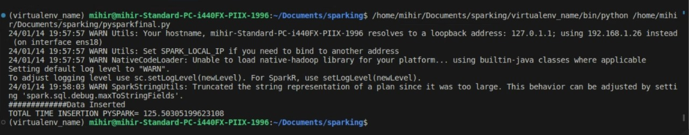

# Data Load Performance Comparison

This repository contains a comparative study of data loading performance into a MySQL database using Pandas and PySpark. The aim of this project is to analyze and compare the time required to load a CSV dataset into MySQL using both Pandas and PySpark, highlighting the strengths and limitations of each approach.

## Overview

- **Comparison**: Compares the performance of Pandas and PySpark for loading data into a MySQL database.
- **Dataset**: Uses a sample CSV dataset of 1Million rows for benchmarking the loading process.
- **Analysis**: Provides insights into the load times, resource utilization, and efficiency of both Pandas and PySpark methods.
- **Benchmarking**: Conducts a benchmarking study to evaluate the scalability and reliability of each approach.

## Key Features

- **Pandas Load**: Demonstrates loading CSV data into MySQL using the Pandas library.
- **PySpark Load**: Illustrates loading CSV data into MySQL using the PySpark framework.
- **Performance Metrics**: Measures and compares various performance metrics such as load time, memory usage, and CPU utilization.
- **Benchmarking Results**: Presents benchmarking results and analysis to facilitate informed decision-making.
- **Scalability Testing**: Explores the scalability of both Pandas and PySpark approaches under different dataset sizes.

## Requirements

- MySQL database server
- Python 3.x
- Pandas
- PySpark
- time module
- memory_profiler

## Usage

1. Clone this repository:

    ```bash
    git clone https://github.com/mihirsar/data-load-performance-comparison.git
    ```

2. Navigate to the project directory:

    ```bash
    cd data-load-performance-comparison
    ```


3. Run the performance comparison scripts:

    - For Pandas: `python pandas.py`
    - For PySpark: `python pysparkfinal.py`

## Contributions

Contributions are welcome! If you have suggestions, improvements, or would like to add new features, please feel free to submit a pull request.

## Observation
- Pandas took an hour to make a query and write the query to the db
- pyspark used jdbc to dump csv to mysql db, no specific querying required took mere 125seconds to dump csv

## Time required by Pyspark

## csv on mysql server


